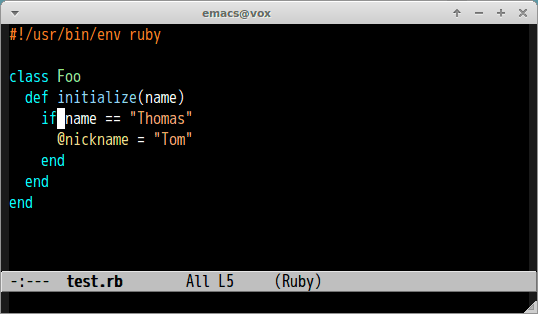

# splitjoin.el [![travis badge][travis-badge]][travis-link] [![melpa badge][melpa-badge]][melpa-link] [![melpa stable badge][melpa-stable-badge]][melpa-stable-link]

Emacs port of [splitjoin.vim](https://github.com/AndrewRadev/splitjoin.vim).

## ScreenCast

## Support Modes

- ruby-mode
- coffee-mode

## Command

#### `M-x splitjoin`

Transition between multiline and single-line code.

[travis-badge]: https://travis-ci.org/syohex/emacs-splitjoin.svg
[travis-link]: https://travis-ci.org/syohex/emacs-splitjoin
[melpa-link]: http://melpa.org/#/splitjoin
[melpa-stable-link]: http://stable.melpa.org/#/splitjoin
[melpa-badge]: http://melpa.org/packages/splitjoin-badge.svg
[melpa-stable-badge]: http://stable.melpa.org/packages/splitjoin-badge.svg
